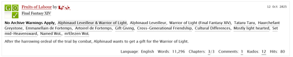
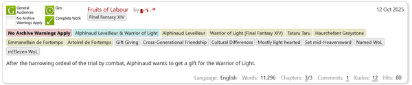

# Better AO3 Tags and Fonts

**Better AO3 Tags and Fonts** is a user stylesheet for [Archive Of Our Own](https://archiveofourown.org) designed to improve usability and readability throughout the archive. It does so through two main functions:

- It adds colour backgrounds to work tags to make them stand out more;
- It enables you to change the fonts used on the archive.

## Screenshots

Screenshots from the *Final Fantasy XIV* fandom page. Click the
thumbnails for the full images.

| Without Better AO3 Tags and Fonts                                                                                                                                                                          | :sparkles: :rainbow: With Better AO3 Tags and Fonts :rainbow: :sparkles:                                                                                                                                                              |
| ---------------------------------------------------------------------------------------------------------------------------------------------------------------------------------------------------------- | ----------------------------------------------------------------------------------------------------------------------------------------------------------------------------------------------------------------- |
|  |  |

### Features

- Work tags are colour-coded by category for quick parsing
    - **Red:** Any of the Archive's content warning tags
    - **Cyan:** Relationships tags
    - **Yellow:** Characters tags
    - **Grey:** Freeform tags
- The 4 mandatory symbols now display text labels in addition to the symbols.
- By default, the stylesheet applies the following font changes to the Archive
    - **UI:** Segoe UI
    - **Text:** Verdana
    - Custom fonts can be set by the user from a dropdown list (if the user has the font installed on their device)
- Work pages have narrower body text for optimal readability
    - **Width:** 45 em
- Documentation, news and FAQ pages have narrower body text for optimal readability
    - **Width:** 65 em

## Quick Usage

### TL;DR

:tada: Enjoy! :tada:

## Detailed Usage

### Prerequisites

This is a **user stylesheet** that gets applied to a **website** thanks to a
**userstyle manager extension** installed in your browser. You will need a
userstyle manager that supports installing UserCSS stylesheets. I personally use
**Stylus** (for
[Firefox & Firefox for Android:tm:](https://addons.mozilla.org/en-US/firefox/addon/styl-us/), for
[Chrome & Edge](https://chrome.google.com/webstore/detail/stylus/clngdbkpkpeebahjckkjfobafhncgmne),
for [Opera](https://addons.opera.com/en-gb/extensions/details/stylus/)).

### Installing

1. Using a userstyle manager that supports installing UserCSS stylesheets (see
   **Prerequisites**), open the raw CSS file inside the browser by clicking on the
   following link:
   [:package: Install the stylesheet](https://raw.githubusercontent.com/nyxmidnight/ao3tagsfonts/master/css/ao3butbetter.user.css)
1. Your userstyle manager will open the stylesheet. [Click this link to see a screenshot](img/stylus_extension_stylesheet_install_screen.png).
1. The sidebar on the left (or on top, if you're using a device with a small screen) will have an **Install Style** button to install the stylesheet. Click on it to install the stylesheet.
1. Below the "Install" button, there is a checkbox to enable automatic updates to the stylesheet. By default, it's checked. Leave it checked to automatically receive the updated stylesheet from GitHub whenever I make updates.
1. You can also use the Configuration Options box to change the default stylesheet's options to whatever you like. This step is optional and the stylesheet will work even if you don't touch anything here.
1. :tada: Enjoy improved readability on AO3! :tada:

### Configuration

The instructions and details of the configuration options have been moved to the repository's wiki.

## Technical details

### Built With

- CSS!
- [UserCSS](https://github.com/openstyles/stylus/wiki/Usercss)
- [Stylus](https://github.com/openstyles/stylus) - Userstyle manager
- [Firefox](https://firefox.com/)'s Web Development Tools

### Roadmap

See the project's [ROADMAP.md](ROADMAP.md).

### Versioning

I use [Semantic Versioning](https://semver.org/) for versioning. To summarize:
each version is numbered according to a (major).(minor).(patch) numbering
scheme. If the (patch) number goes up, that's a backward compatible bug fix. If
the (minor) patch number goes up, that's a backward compatible new function
added. If the (major) number goes up, that's a whole new version that is not
backward compatible.

### Contributing

Feel free to fork the repo or download the stylesheet and mess with it at your
leisure! If you want to contribute code improvements or additional features, there is a [Code of Conduct](CODE_OF_CONDUCT.md) and [Contribution Guidelines](CONTRIBUTING.md).

### Support

If anything doesn't work as intended or expected, or to suggest further
tweaking, please feel free to open an issue on this repo and I'll gladly look
into it. If you don't have/don't want to create a GitHub account, you can
[contact me with the form on my blog](https://blog.nyx.zone/contact/).

### Author

**Nyx** - [NyxMidnight](https://github.com/nyxmidnight)

### License

To the extent possible under law, [Nyx Midnight](https://github.com/nyxmidnight)
has waived all copyright and related or neighboring rights to this work. This
work is published from: Canada.

### Acknowledgement

Based on the public domain work of
[Athari](https://userstyles.org/styles/152660/archiveofourown-org-fonts-tags-ath).
