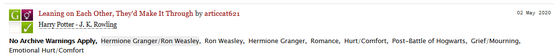
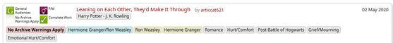

# Better AO3 Tags and Fonts

      

**Better AO3 Tags and Fonts** is a user stylesheet to make tags stand out more and enable better font choices on ArchiveOfOurOwn.org to improve usability and readability. It now also supports the _OpenDyslexic_ font.

## Screenshots

Screenshots from the _Harry Potter - J. K. Rowling_ fandom page. Click the thumbnails for the full images.

| Without Better AO3 Tags and Fonts                                                                                                    | :sparkles: With Better AO3 Tags and Fonts :sparkles:                                                                                           |
| ------------------------------------------------------------------------------------------------------------------------------------ | ---------------------------------------------------------------------------------------------------------------------------------------------- |
|  |  |

### Features

-   Tags coloured by category
    -   **Red:** Archive's content warnings
    -   **Cyan:** Relationships
    -   **Yellow:** Characters
    -   **Grey:** Freeform tags
-   Visible labels for mandatory tag icons
-   Better default font choices
    -   **UI:** Segoe UI
    -   **Text:** Verdana
-   Custom fonts can be set by the user from a dropdown list (if the user has the font installed on their device)
-   Better default text width on works
    -   **Width:** 45 em
-   Better default text width for documentation, news and FAQ
    -   **Width:** 65 em

## Getting Started

### TL;DR

### Prerequisites

This is a **user stylesheet** that gets applied to a **website** thanks to a **userstyle manager extension** installed in your browser. You will need a userstyle manager that supports installing UserCSS stylesheets. I personally use **Stylus** (for [Firefox](https://addons.mozilla.org/en-US/firefox/addon/styl-us/), for [Chrome & Edge](https://chrome.google.com/webstore/detail/stylus/clngdbkpkpeebahjckkjfobafhncgmne), for [Opera](https://addons.opera.com/en-gb/extensions/details/stylus/)).

### Installing

1.  Using a userstyle manager that supports installing UserCSS stylesheets (see **Prerequisites**), open the raw file within the browser by clicking on the next link.
    :package: [Install the userCSS](https://raw.githubusercontent.com/nyxmidnight/ao3tagsfonts/master/css/ao3butbetter.user.css)
2.  The userstyle manager will open the stylesheet. The sidebar on the left will have an **Install Style** button to install the user style. Below is a checkbox to receive updates. Leave it checked to automatically receive the updated stylesheet whenever I update it.
3.  Click the **Install Style** button to install the user style in your browser.
4.  :tada: Enjoy improved readability on AO3!

#### To Set Custom Fonts

1.  Navigate to [AO3](https://archiveofourown.org).
2.  Click on the Stylus icon in your toolbar. A list of stylesheets applied at this URL will appear. **Better AO3 Tags and Fonts** will appear with three icons to the right: a gear, a pencil, and three vertical dots.
3.  Click on the gear :gear:. A modal dialog appears with 4 menus: Site interface font, Work summary font, Story body font, News and docs font.
4.  Pick a font from each of the dropdown menus (it can be all the same font or a different font for each, all that matters is your reading comfort).
5.  If auto save is not enabled, click on the save button.
6.  Optionally, enable auto save.
7.  Enjoy better readability on AO3!

#### On Custom Fonts

This user stylesheet includes an optional configuration modal with dropdown menus to select the font(s) you wish to use on AO3. The font selected in this menu will **only** work if you have the corresponding font installed on the computer you are currently using. Here is a list of the fonts available in the menu. Some are web-safe option that come pre-installed on different Mac and Windows computers, while some are free fonts. I have provided links to download the free fonts.

-   system-ui: This option uses the default system font pre-installed on a Mac computer or an iOS phone.
-   Segoe UI: A font that comes pre-installed with Windows and Windows program for Windows 7 to 10 inclusively.
-   Arial: A web-safe option that comes pre-installed on most Mac and Windows computers.
-   Helvetica Neue: A common pre-installed Mac font.
-   [Lato](http://www.latofonts.com/lato-free-fonts/): An open source font by Warsaw-based designer Łukasz Dziedzic that can be downloaded and installed for free.
-   [Noto Sans](https://www.google.com/get/noto/): An open source font made by Google. This family of fonts was created for consistency across many different languages, even those that do not use the Latin alphabet. A personal favourite of mine. Can be downloaded and installed for free.
-   [OpenDyslexic](https://opendyslexic.org/): As the website says, "[A] typeface designed against some common symptoms of dyslexia." Hopefully, if you are dyslexic, using it will make AO3 easier to read. Can be downloaded and installed for free (donations appreciated).
-   [Open Sans](https://www.opensans.com/): An open source font commissioned by Google and designed by Steve Matteson, Type Director of Ascender Corp. Can be downloaded and installed for free.
-   Roboto: A font pre-installed on Android devices.
-   Trebuchet MS: A font pre-installed on Windows XP, macOS, iOS and Chrome OS.
-   [Ubuntu](https://design.ubuntu.com/font/): An open source font designed for Ubuntu (Linux).
-   Verdana: Another common web-safe font pre-installed on most Windows and Mac computers. This font is easy to read at low resolutions.
-   sans-serif: If all else fails, this option uses the default sans-serif font on your machine.

## Technical details

### Built With

-   CSS!
-   UserCSS
-   [Stylus](https://github.com/openstyles/stylus) - Userstyle manager
-   [Firefox](https://firefox.com/)'s Web Development Tools

### Full Features

-   Tags coloured by category
    -   **Red:** Archive's content warnings (Graphic depiction of violence, Major character death, Rape/non-con, Underage, or None, or Choose Not To Use Archive Warnings)
    -   **Cyan:** Relationships
    -   **Yellow:** Characters
    -   **Grey:** Other information (freeform tags)
-   Better default font choices
    -   **UI:** Segoe UI
    -   **Text:** Verdana
-   Fonts can now be set by the user from a dropdown list, if the user has the font installed on their computer
    -   **Site interface font:** system-ui (mac), "Segoe UI" (default), "Arial", "Helvetica Neue", "Lato", "Noto Sans", "OpenDyslexic", "Open Sans", "Roboto", "Trebuchet", "Ubuntu", "Verdana", "sans-serif"
    -   **Work summary font, Story body font** and **News & documentation font:** "Arial", "Helvetica Neue", "Lato", "Noto Sans", "OpenDyslexic", "Open Sans", "Roboto", "Trebuchet", "Ubuntu", "Verdana" (default), "sans-serif"
-   Better default text width on works
    -   **Width:** 45 em
-   Better default text width for documentation, news and FAQ
    -   **Width:** 65 em
-   Visible labels for mandatory tag icons (Content rating; Relationships, pairings, orientations; Content warnings; Finished or In progress.)

### Screenshots

Screenshots taken with "Noto Sans" font selected in all menus.

    

   

### Roadmap

-   [ ] Do a page review throughout the archive, both logged in and logged out, to detect any place where the stylesheet does not behave as expected.
-   [ ] Correct the bugs/issues found in the above-mentioned review.
-   [ ] Create a wiki for this repository for more in-depth explanations for less tech-savvy users, complete documentation, and declutter this README.
-   [ ] Take better screenshots to better document the differences between plain AO3 and AO3 with the stylesheet applied, and blur out names.
-   [ ] Investigate the possibility of converting this stylesheet into an AO3 Site Skin.
-   [x] Convert to UserCSS format for easy installation with the Stylus browser extension.
-   [x] Add user customizable variables.
-   [x] Fix spacing issues with icon labels.
-   [x] Fix overlapping text issues in Series headings.

### Versioning

I use [Semantic Versioning](http://semver.org/) for versioning. To summarize: each version is numbered according to a (major).(minor).(patch) numbering scheme. If the (patch) number goes up, that's a backward compatible bug fix. If the (minor) patch number goes up, that's a backward compatible new function added. If the (major) number goes up, that's a whole new version that is not backward compatible.

### Contributing

Feel free to fork the repo or download the stylesheet and mess with it at your leisure!

### Support

If anything doesn't work as intended or expected, or to suggest further tweaking, please feel free to open an issue on this repo and I'll gladly look into it. If you don't have/don't want to create a GitHub account, you can [contact me with the form on my blog](https://blog.nyx.zone/contact/).

### Author

**Nyx** - [NyxMidnight](https://github.com/nyxmidnight)

### License

To the extent possible under law, [Nyx Midnight](https://github.com/nyxmidnight) has waived all copyright and related or neighboring rights to this work. This work is published from: Canada.

### Acknowledgements

Based on the public domain work of [Athari](https://userstyles.org/styles/152660/archiveofourown-org-fonts-tags-ath).
